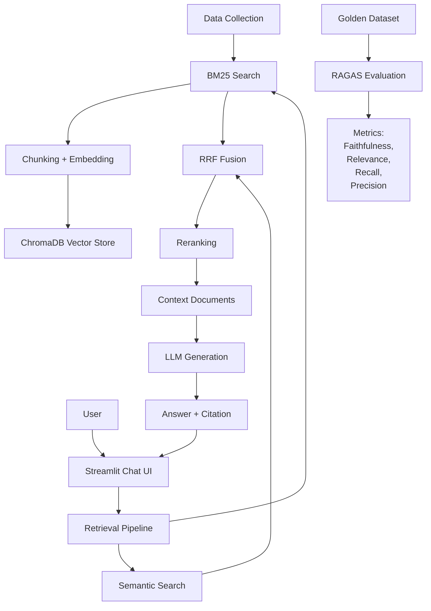

# Bài Tập Nhóm — E-commerce Support RAG Chatbot

## Mục Tiêu

Xây dựng chatbot hỗ trợ khách hàng thương mại điện tử sử dụng kiến trúc **RAG Pipeline v2**.

Chức năng chính:

- Trả lời câu hỏi về chính sách thương mại điện tử.
- Có citation nguồn.
- Hỗ trợ follow-up questions.
- Hiển thị source documents.
- Đánh giá chất lượng bằng RAG Evaluation.

Stack:

- Streamlit
- ChromaDB
- Semantic Search
- BM25
- RRF Reranking
- PageIndex Fallback
- RAGAS Evaluation


---

# Kiến Trúc Hệ Thống





---

# Pipeline


## Retrieval

```
Query
 |
 +--> Semantic Search
 |
 +--> BM25 Search
 |
 +--> RRF Fusion
 |
 +--> Reranking
 |
 +--> Context
```


## Generation

- LLM sinh câu trả lời dựa trên context.
- Bắt buộc citation.
- Không trả lời nếu không có evidence.


---

# Tính năng Chatbot

- Streamlit chat interface.
- Conversation memory.
- Follow-up questions.
- Hiển thị nguồn tài liệu sử dụng.
- Citation trong câu trả lời.


---

# Evaluation Pipeline


Framework:

```
RAGAS
```


Golden Dataset:

```
group_project/evaluation/golden_dataset.json
```

Yêu cầu:

- >=15 câu hỏi Q&A.


Metrics:

| Metric | Ý nghĩa |
|-|-|
| Faithfulness | Câu trả lời có đúng context |
| Answer Relevance | Trả lời đúng câu hỏi |
| Context Recall | Retriever lấy đủ evidence |
| Context Precision | Context có hữu ích |


A/B Testing:

| Config | Mô tả |
|-|-|
| Config A | Hybrid Retrieval + RRF + Reranking |
| Config B | Dense Retrieval Only |


Kết quả:

```
group_project/evaluation/results.md
```


---

# Phân Công Công Việc


| Thành viên | Nhiệm vụ |
|-|-|
| Nguyễn Ngọc Huân | RAG Architecture, Backend Integration |
| Vương Đức Thoại | Data Processing, Retrieval Pipeline |
| Lê Đình Việt | Streamlit UI, Conversation Memory |
| Quách Thanh Hưng | Golden Dataset, Evaluation |


---

# Cấu Trúc Thư Mục


```text
group_project/

├── README.md

└── evaluation/

    ├── golden_dataset.json

    ├── eval_pipeline.py

    └── results.md


app.py

src/

├── task5_semantic_search.py

├── task6_lexical_search.py

├── task7_reranking.py

├── task8_pageindex_vectorless.py

├── task9_retrieval_pipeline.py

└── task10_generation.py
```


---

# Hướng Dẫn Chạy


Cài đặt:

```bash
pip install -r requirements.txt
pip install ragas datasets
```


Chạy chatbot:

```bash
streamlit run app.py
```


Chạy evaluation:

```bash
python -m group_project.evaluation.eval_pipeline
```


Chạy test:

```bash
pytest tests/ -v
```


---

# Deliverables

- [x] RAG Chatbot Demo
- [x] Retrieval Pipeline Task 1-10
- [x] Citation Generation
- [x] Golden Dataset >=15 Q&A
- [x] RAGAS Evaluation
- [x] A/B Comparison
- [x] Evaluation Report


---

# Hướng Phát Triển

- Tích hợp Knowledge Graph.
- Cải thiện Reranking.
- Deploy chatbot production.